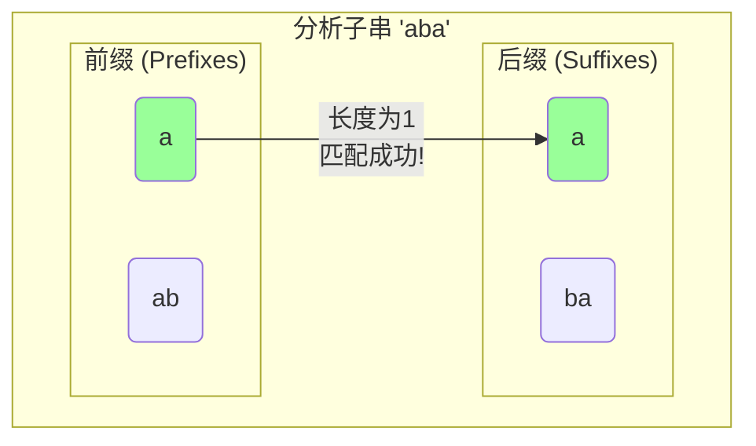

### **5.4 心有灵犀的暗号速递【串·KMP】**

*“真正的聪慧，不是从不犯错，而是在每一次失败后，都能汲取经验，从而在下一次迈出更远的一步。这，是失败赠予探索者的无价之礼。”*

夜色渐深，活动室窗外的天空已是深邃的藏蓝，几颗早亮的星辰在天幕上闪烁。室内，落地灯的光晕温暖而宁静。

然而，安妮的心情却不像这夜晚一样平静。她依然在为黛芙学姐描绘的那个“最坏情况”而耿耿于怀——那个在`AAAAAAAAAAAAAB`长街上，固执地寻找着`AAAAAC`的“笨侦探”。每一次都只差临门一脚，却又每一次都傻傻地退回到起点，重做大量无用功。

“我……我感觉好心疼那个侦探啊。”安妮小声地说，脸上满是同情，“他那么努力，却一直在做重复的事情，一定很累吧。就没有办法让他变得‘聪明’一点吗？”

希娅靠在椅背上，双手枕在脑后，深有同感地说：“是啊！要是我，早就被这种重复劳动逼疯了！每次失败后，他明明站在一堆‘A’中间，却假装没看见，非要挪一格再回头重新看一遍。这智商，急死我了！”

“你们的感受，正是许多天才程序员最初的感受。”黛芙的声音在安静的活动室里响起，带着一丝引导的意味，“正是这种对‘低效’的无法容忍，才催生了算法的进化。安妮，希娅，你们刚才都提到了一个关键点——**重复**。侦探之所以‘笨’，是因为他没有利用好他已经看到的信息。”

她顿了顿，抛出了一个启发性的问题：“当侦探在主串上匹配`AAAAA`成功，在第6个字符处失败时，他知道他刚刚看到了五个连续的‘A’。那么，当他准备下一次匹配时，有没有可能利用这个信息，让他**不必只移动一格**，而是**跳到一个更远、也更有可能成功的位置**呢？”

“跳得更远？”安妮的眼睛亮了一下，随即又有些迷茫，“可是……他怎么知道该跳多远呢？跳错了怎么办？”

“这就是关键所在。”伊莎贝尔微笑着接过话头，她的声音仿佛带着魔力，将众人的思绪引向一个全新的维度，“如果说，BF算法是一个只懂得低头看路的‘憨厚侦探’，那么我们接下来要认识的KMP算法，就是一位在出发前，就已经对自己了如指掌的‘智慧侦探’。”

“在开始搜寻之前，这位智慧侦探会先花一些时间，仔细研究他的‘嫌疑人画像’——也就是**模式串**本身。他要为这个模式串，制作一份专属的‘**自我认知速查表**’。”

“自我认知速查表？”这个新名词瞬间勾起了安妮和希娅的好奇心。

“是的。”黛芙走到白板前，“这份速查表，记录了模式串内部所有‘**前缀**’和‘**后缀**’的重复信息。它就像一份‘**似曾相识（Deja Vu）**’的秘密档案。这份档案，能让侦探在匹配失败时，瞬间拥有‘心有灵犀’般的直觉，知道自己下一步该怎么走。在算法世界里，这份速查表，通常被称为`next`数组，或者更准确地，叫做**最长公共前后缀（LPS, Longest Proper Prefix which is also Suffix）数组**。”

---
#### **§2. 直观演示：制作模式串的“似曾相识”速查表**

“听起来好复杂……”安妮小声嘀咕。

“别怕，我们用一个游戏来制作它。”伊莎贝尔柔声说，“我们来分析一个稍微复杂点的模式串，比如 `P = "ababa"`。我们要为它的每一个子串，都找到那个‘似曾相识’的瞬间。”

伊莎贝尔在白板上写下模式串，并开始逐一分析：

**1. 当我们只看第一个字符 `"a"` 时：**
   *   它没有“前面部分”（前缀），也没有“后面部分”（后缀），所以“似曾相识”的长度是 **0**。

**2. 当我们看前两个字符 `"ab"` 时：**
   *   它的“前面部分”只有`"a"`。
   *   它的“后面部分”只有`"b"`。
   *   两者不相等。“似曾相识”的长度是 **0**。

**3. 当我们看前三个字符 `"aba"` 时：**
   *   **前缀们：** `"a"`, `"ab"`
   *   **后缀们：** `"a"`, `"ba"`
   *   看！前缀`"a"` 和后缀`"a"` 完全一样！这是最长的公共部分。
   *   “似曾相识”的长度是 **1**。



**4. 当我们看前四个字符 `"abab"` 时：**
   *   **前缀们：** `"a"`, `"ab"`, `"aba"`
   *   **后缀们：** `"b"`, `"ab"`, `"bab"`
   *   最长的公共部分是 `"ab"`。
   *   “似曾相识”的长度是 **2**。

**5. 当我们看全部五个字符 `"ababa"` 时：**
   *   **前缀们：** `"a"`, `"ab"`, `"aba"`, `"abab"`
   *   **后缀们：** `"a"`, `"ba"`, `"aba"`, `"baba"`
   *   最长的公共部分是 `"aba"`。
   *   “似曾相SHI”的长度是 **3**。

伊莎贝尔将结果整理成一张表格：

| 子串       | 最长公共前后缀 | 长度(LPS值) |
|------------|------------------|---------------|
| `"a"`      | ""               | 0             |
| `"ab"`     | ""               | 0             |
| `"aba"`    | `"a"`            | 1             |
| `"abab"`   | `"ab"`           | 2             |
| `"ababa"`  | `"aba"`          | 3             |

“这张表，就是模式串`"ababa"`的`next`数组（LPS速查表）！”黛芙总结道，“`next = [0, 0, 1, 2, 3]`。它告诉侦探，在模式串的**任何一个位置**`j`匹配失败时，下一个应该回来继续比较的位置，就是`next[j-1]`。”

“这到底有什么用呢？”希娅迫不及待地问。

黛芙在白板上画出了KMP算法的核心工作场景：

“假设我们在主串`T`中，用模式串`P="ababa"`匹配，并且已经在`j=4`的位置上匹配成功，但在`j=5`的位置失败了。”

```
主串 T:  ... a b a b c ...
模式串 P:    a b a b a
                  ↑
                  j=4 (已匹配成功的部分)

下一刻:
主串 T:  ... a b a b c ...
                  ↓ (主串指针 i 在这里)
模式串 P:    a b a b a
                    ↑ (模式串指针 j 在这里，发现 'c' != 'a'，匹配失败!)
```
“BF算法的笨侦探会怎么做？”黛芙问。
“他会把模式串右移一格，然后从头开始比较！”安妮立刻回答。

“对。但他浪费了宝贵信息！”黛芙的眼神变得锐利，“而我们的智慧侦探，此刻会立刻查阅他的`next`速查表。他知道在`j=4`这个位置之前，他已经成功匹配了`"abab"`。速查表告诉他，`"abab"`的最长公共前后缀长度是**2**（`next[4-1]`也就是`next[3]`的值是2）。”

“这代表什么？这代表他刚刚匹配成功的那段`"abab"`的**结尾两个字符`"ab"`**，和他要找的模式串的**开头两个字符`"ab"`**，是**一模一样的**！”

“所以，他根本不需要把模式串移回起点！他只需要做一次聪明的‘滑动’，让模式串开头的那个`"ab"`，和他刚刚在主串上看到过的那个`"ab"`对齐就行了！”

黛芙用彩色粉笔画出了这个“灵犀一动”的瞬间：

```
失败时的情况:
主串 T:  ... [a b a b] c ...
                |     |
模式串 P:      [a b a b] a
                ↑     ↑
             前缀"ab"  后缀"ab"  (这就是LPS=2的意义!)

KMP的智能滑动:
主串 T:  ... a b a b c ...     (主串指针 i 根本不用动!)
                  ↓
模式串 P:          a b a b a     (模式串像滑动火柴盒一样，对齐了已知的公共部分)
                    ↑ 
                  (模式串指针 j 直接跳回索引2的位置，继续比较)
```

“天哪！”安妮和希娅异口同声地发出了惊叹。

“我明白了！”安妮兴奋地跳了起来，“因为模式串的后缀和前缀有重合，所以当后缀匹配成功时，就意味着主串的那一段，也一定和模式串的前缀长得一样！所以可以直接把模式串的前缀滑过去对齐，主串的指针根本不需要后退！这就是‘跳跃’的秘密！”

“完全正确。”黛芙的嘴角，终于扬起一抹难以掩饰的赞许弧度。“KMP算法的精髓就在于：**主串指针永不后退，通过`next`数组让模式串指针进行高效的跳转**。”

---
#### **§3. 深入剖析：KMP的实现与复杂度**

“那么，这个神奇的`next`速查表，要怎么用代码生成呢？”安妮追问，她已经完全沉浸在了KMP算法的魅力之中。

“这本身也是一个‘自己匹配自己’的精妙过程。”黛芙回答，“我们用两个指针，一个`i`在后面跑，代表当前正在构建LPS的子串的末尾；一个`j`在前面跑，代表可能的最长公共前缀的末尾。”

黛芙在电脑上展示了构建`next`数组的代码，并逐行解释：

```python
def compute_lps_array(pattern):
    """计算模式串的LPS(next)数组"""
    m = len(pattern)
    lps = [0] * m  # 初始化LPS数组，所有值都为0
    
    length = 0  # 'length' 记录当前已知的最长公共前后缀的长度 (相当于指针j)
    i = 1       # 'i' 用来遍历模式串，从第二个字符开始
    
    while i < m:
        if pattern[i] == pattern[length]:
            # 情况1: 新字符与LPS的下一个字符匹配
            length += 1
            lps[i] = length
            i += 1
        else:
            # 情况2: 不匹配
            if length != 0:
                # 尝试缩短LPS，寻找更短的可以匹配的前后缀
                length = lps[length - 1]
            else:
                # 情况3: LPS已经缩无可缩 (为0了)
                lps[i] = 0
                i += 1
    return lps

# --- 测试 ---
pattern = "ababa"
lps_table = compute_lps_array(pattern)
print(f"模式串 '{pattern}' 的LPS(next)数组是: {lps_table}")
```
运行结果：
`模式串 'ababa' 的LPS(next)数组是: [0, 0, 1, 2, 3]`

黛芙耐心地带着安妮在白板上，一步步推演了`compute_lps_array("ababa")`的完整过程，展示了`i`和`length`指针的每一次移动、比较和赋值，直到安妮完全理解了这个“自我匹配”过程的每一个细节。

“现在，我们拥有了最关键的武器——`next`数组。KMP的搜索函数就变得非常直观了。”黛芙展示了最终的代码。

```python
def kmp_search(text, pattern):
    """KMP搜索算法主函数"""
    n = len(text)
    m = len(pattern)
    
    if m == 0:
        return 0
    
    lps = compute_lps_array(pattern) # 关键：预先计算LPS数组
    
    i = 0  # text的指针 (永不后退!)
    j = 0  # pattern的指针
    
    while i < n:
        if pattern[j] == text[i]:
            # 字符匹配，两个指针都前进
            i += 1
            j += 1
        
        if j == m:
            # 模式串完全匹配成功！
            print(f"在索引 {i - j} 处找到匹配")
            # 继续寻找下一个匹配，根据LPS数组移动j
            j = lps[j - 1] 
        elif i < n and pattern[j] != text[i]:
            # 发生不匹配
            if j != 0:
                # j跳转到上一个LPS的位置
                j = lps[j - 1]
            else:
                # j已经是0了，无法再跳转，只能让i前进
                i += 1
    
# --- 测试 ---
kmp_search("ababababc", "ababc")
```
运行结果：
`在索引 2 处找到匹配`

“我们来分析一下它的效率。”黛芙在白板上写道，“`compute_lps_array`函数中，指针`i`从头到尾遍历了一遍模式串，所以它的时间复杂度是 **O(n)**，n是模式串的长度。”

“而在`kmp_search`函数中，最奇妙的事情发生了：主串的指针`i`**永远不会向后移动**，它只会一路向前。所以，它最多也只是把主串从头到尾看一遍。因此，搜索部分的时间复杂度是 **O(m)**，m是主串的长度。”

“所以，KMP算法的总时间复杂度是 **O(m + n)**！”希娅兴奋地喊道，“这比BF算法的O(m * n)在最坏情况下快了不止一个数量级啊！”

---
#### **§4. 情感升华：失败的价值**

安妮静静地看着白板上那复杂的跳转逻辑，眼神中闪烁着前所未有的光芒。她终于明白了。KMP算法的“聪明”，不在于它匹配得有多快，而在于它**处理失败的方式**。

“我明白了，”安妮轻声说，但语气却无比坚定，“BF算法把每一次失败都当成一次彻底的终结，然后从头再来。但KMP算法……它把每一次失败都看作是一次宝贵的学习机会。它从失败中提取出‘我错在哪里’、‘我已经知道了什么’的信息，然后利用这些信息，做出下一次最优的选择。”

她抬起头，看向黛芙：“学姐，这不只是算法，对不对？这好像……也是在教我们怎么学习，怎么面对困难。”

黛芙的眼中闪过一丝惊讶，随即化为深深的赞许和欣慰。她走过去，轻轻地摸了摸安妮的头，这是她第一次如此直接地表达自己的肯定。

“你说的很对，安妮。”黛芙的声音比平时柔和了许多，“一个优秀的算法，往往蕴含着某种深刻的哲学。KMP教会我们的，就是**失败的价值**。不要畏惧错误和不匹配，关键在于，你是否能从中学到东西，让自己下一次的尝试，站在一个更高的起点上。”

这一刻，活动室里无比安静。安妮觉得，自己不仅仅是学会了一个精妙的算法，更像是透过这由0和1构成的智慧之窗，窥见了一丝人生的真谛。

---
#### **§5. 小说收尾：黛芙的深夜沉思**

深夜，黛芙合上了笔记本。桌角的台灯下，摊开的草稿纸上画满了KMP算法的推演图。她没有在看算法，思绪却飘回了几个小时前，安妮说出那番话时的情景。

“失败的价值……”她低声重复着。

一直以来，她追求的都是最优解，是逻辑上的完美闭环。她习惯于用最直接、最高效的方式解决问题，就像她欣赏KMP算法的O(m+n)一样。但她很少去思考“失败”本身的过程。

安妮不一样。她会为BF算法的“笨拙”而感到心疼，也能从KMP对失败的处理中，感悟出学习与成长的方法论。她的视角，总是带着一种与生俱来的、对过程本身的共情与关怀。

或许，这才是比算法本身更宝贵的东西。

黛芙关上台灯，窗外星光璀璨。她想，也许自己在这个小小的社团里，能教给安妮的，远不止是算法。而从这个充满灵气的学妹身上，自己能学到的，也远比想象中要多。

---

### **§6. 技术总结**

> **KMP算法 (Knuth-Morris-Pratt Algorithm)**：是一种高效的字符串匹配算法，由Donald Knuth、Vaughan Pratt和James H. Morris在1970年代联合设计。其核心思想是，通过对模式串（Pattern）进行预处理，生成一个“部分匹配表”（Partical Match Table，也称`next`数组或LPS数组），该表记录了模式串中每个前缀子串的最长公共前后缀长度。在匹配过程中，当发生字符不匹配时，算法能够利用这个表，将模式串进行一次“智能”的大幅滑动，从而跳过大量不必要的比较。这使得主串的指针无需回溯，显著提高了匹配效率，使其时间复杂度从暴力匹配的O(m*n)优化到了线性的O(m+n)。

🌸 **KMP 算法核心要点** 🌸

**1. 核心突破：避免主串指针回溯**
-   BF算法的瓶颈在于，每次失配后主串指针`i`都需要回退，导致重复比较。
-   KMP的核心优势是主串指针`i`**永不回退**，一路向前。

**2. 关键武器：`next` (LPS) 数组**
-   **定义：** `next[i]` (或`LPS[i]`) 的值，代表了模式串中，从`0`到`i`的这个**子串**的“最长公共前后缀”的长度。
-   **作用：** 当模式串在`j`位置发生失配时，`next`数组告诉我们，模式串应该回退到哪个位置(`j = next[j-1]`)继续与主串当前位置进行比较，相当于一次聪明的“滑动”。

**3. KMP 两步走**
-   **第一步：预处理模式串。** 花费O(n)时间，计算出模式串自身的`next`数组。这是一个“自己匹配自己”的过程。
-   **第二步：执行搜索。** 花费O(m)时间，利用`next`数组在主串中进行不回溯的匹配。

**4. 性能**
-   **时间复杂度：** **O(m + n)**，其中m为主串长度，n为模式串长度。这是一个线性时间复杂度的算法，效率极高。
-   **空间复杂度：** **O(n)**，主要用于存储`next`数组。

### 今日关键词

-   **KMP算法 (Knuth-Morris-Pratt Algorithm):** 一种线性时间复杂度的字符串匹配算法，通过预处理模式串来避免主串指针的回溯。
-   **前缀 (Prefix):** 字符串中从第一个字符开始，不包含最后一个字符的所有子串。例如，"apple"的 प्रॉपर 前缀有 "a", "ap", "app", "appl"。
-   **后缀 (Suffix):** 字符串中从最后一个字符开始，不包含第一个字符的所有子串。例如，"apple"的 प्रॉपर 后缀有 "e", "le", "ple", "pple"。
-   **最长公共前后缀 (Longest Proper Prefix which is also Suffix, LPS):** 对于一个字符串，其所有真前缀和真后缀中最长的相等字符串。这是`next`数组的本质。
-   **`next`数组 (next array):** KMP算法中用于存储模式串部分匹配信息的辅助数组，其每个元素的值等于对应子串的LPS长度。

### 推荐练习题目 🧲

**基础入门（必做）：**
1.  **LeetCode 28. Find the Index of the First Occurrence in a String (找出字符串中第一个匹配项的下标)**：KMP算法的“模板题”，必须亲手实现一遍。 ⭐⭐⭐
2.  **手动计算`next`数组**：任选一个字符串，如 "aabaaf"，在纸上一步步推导出它的`next`数组，加深对LPS构建过程的理解。 ⭐⭐
3.  **LeetCode 1392. Longest Happy Prefix (最长快乐前缀)**：这道题就是求解整个字符串的LPS值，是KMP `next`数组构建的直接应用。 ⭐⭐⭐
4.  **HDU 2087. 剪花布条**：计算一个模式串在主串中出现了多少次（可重叠），KMP的简单变种应用。 ⭐⭐
5.  **POJ 3461. Oulipo**：同上，经典的KMP模板练习题。 ⭐⭐
6.  **LeetCode 796. Rotate String (旋转字符串)**：判断一个字符串是否能通过旋转得到另一个。巧妙解法是将主串s1与自身拼接(s1+s1)，然后判断s2是否是其子串。可用KMP加速。 ⭐⭐
7.  **自实现：KMP的所有匹配**：修改KMP代码，使其能够返回模式串在主串中所有出现位置的列表，而不仅仅是第一个。 ⭐⭐⭐

**进阶应用（推荐）：**
8.  **LeetCode 214. Shortest Palindrome (最短回文串)**：通过将原串与反转串拼接，利用KMP的`next`数组寻找最长回文前缀，构思巧妙。 ⭐⭐⭐⭐
9.  **LeetCode 686. Repeated String Match (重复叠加字符串匹配)**：判断最少重复多少次字符串a，可以使b成为其子串。可用KMP进行高效匹配。 ⭐⭐⭐
10. **LeetCode 1397. Find All Good Strings (找到所有好字符串)**：结合数位DP和KMP，难度较大，是KMP与其它算法结合的典范。 ⭐⭐⭐⭐⭐
11. **HDU 1711. Number Sequence**：在大整数序列中匹配另一个序列，将数字当做字符，是KMP思想的活用。 ⭐⭐⭐
12. **LightOJ 1255. Substring Frequency**：KMP模板题，统计出现次数。 ⭐⭐⭐
13. **SPOJ - NHAY - A Needle in the Haystack**：经典的KMP模板练习题。 ⭐⭐⭐

**面试高频（5题）：**
14. **LeetCode 459. Repeated Substring Pattern (重复的子字符串)**：一个字符串是否由其子串重复多次构成。可用KMP的`next`数组求解，`n % (n - next[n-1]) == 0` 是一个神奇的结论。 ⭐⭐⭐
15. **LeetCode 28. (同上)**：面试中最常被要求手写和讲解的KMP题目。 ⭐⭐⭐
16. **LeetCode 214. (同上)**：高频面试题，考察对KMP `next`数组本质的深入理解。 ⭐⭐⭐⭐
17. **问题：KMP算法的时间复杂度为什么是O(m+n)？**：能够清晰地向面试官解释两个阶段的复杂度和指针移动的原理。 ⭐⭐⭐
18. **问题：谈谈KMP和BM算法的异同和适用场景。**：考察知识广度，BM算法通常更快，但KMP在某些情况下更稳定。 ⭐⭐⭐⭐

**考研重点（4题）：**
19. **408真题形式：手算`next`数组和`nextval`数组。**：考研中常考根据给定的模式串，手动计算其`next`数组和优化后的`nextval`数组。 ⭐⭐⭐
20. **408真题形式：模拟KMP匹配过程。**：给出主串和模式串，要求写出KMP算法的匹配过程中，`i`和`j`指针的详细变化步骤。 ⭐⭐⭐
21. **LeetCode 459. (同上)**：该题的数学性质和KMP解法是数据结构考研中的一个热点和难点。 ⭐⭐⭐
22. **算法题：字符串循环节。**：求解字符串的最小循环节，这与`next`数组的性质密切相关，是考研中的一个经典模型。 ⭐⭐⭐⭐