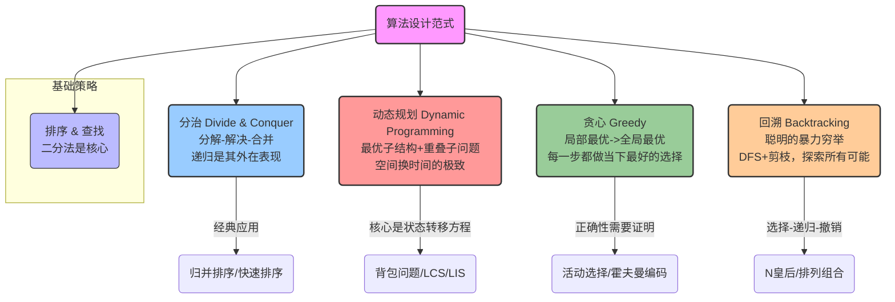

### **卷三 · 终章回望：枫林晚照的策略心法**

*"当漫山的枫叶，染尽秋日的最后一抹晚照，深植于心的，是关于选择、权衡、试探与远见的、那卷在篝火旁，诵读了一整个秋天的策略心法。"*

“XX杯”区域赛的金色奖牌，在社团活动室的荣誉柜里，闪烁着温暖而安静的光芒。那场激动人心的“秋日决战”，已经过去了一段时间，但它带给女孩们的，不仅仅是胜利的喜悦，更是对“算法”这门学问，一次全新的、从“术”到“道”的认知升华。

一个深秋的傍晚，她们结束了一次对区域赛所有题目的、彻底的复盘。窗外，是枫林如火，晚霞满天。

“这个学期，真的好特别。”安妮靠在窗边，看着窗外的景色，由衷地感叹，“卷一，我们像是在学习一门‘语言’，认识了数组、链表这些基本的‘单词’。卷二，我们像是在学习‘建筑学’，学会了用哈希表、树、图，来搭建各种各样的‘建筑’。”

“而这个学期，”她的眼中，闪烁着思辨的光芒，“我们更像是在学习‘**兵法**’。我们不再只关心‘武器’本身，而是开始学习，在不同的‘战场’上，该如何‘排兵布阵’，如何做出最优的‘决策’。”

“说得太好了，安妮！”希娅兴奋地打了个响指，“没错！分治、DP、贪心、回溯……这些东西，它们不是一种具体的数据结构，它们是一种‘**方法论**’，一种‘**思想的范式**’！”

“为了让这本‘兵法书’，能被我们永远铭记，”伊莎贝尔微笑着，铺开了一张巨大的和纸长卷，“我们来共同绘制一幅，属于我们卷三的‘**算法心法长卷**’吧。”

黛芙拿起笔，在这幅长卷的卷首，写下了四个大字：“**算法范式**”。

“我们这个秋天，所学的一切，都围绕着‘如何设计一个高效的策略，来解决一个问题’而展开。”她的声音，如同这静谧的晚照，沉静而富有穿透力。

“这些范式，就像是武学中的不同流派，各有其精髓和适用范围。”

“这幅画卷，太清晰了！”安妮看着沙盘上，那泾渭分明的几大“流派”，感觉整个学期纷繁复杂的知识，瞬间被理清了脉络。

“心法虽好，但修炼时，也需谨防‘走火入魔’。”伊莎贝尔拿起了她的“警示海螺”，这一次，它们是几片被秋霜染得通红的枫叶。

> 🍁 **DP的“维数”陷阱:**
> 当你发现一维的`dp[i]`无法解决问题时，不要害怕，大胆地去“升维”。`dp[i][j]`，甚至`dp[i][j][k]`，都是常见的操作。增加维度，是为了包含足够的状态信息，以满足“无后效性”这一DP的铁律。

> 🍁 **贪心的“近视”诱惑:**
> 永远不要轻易地相信你的“贪心直觉”！对于一个贪心策略，你要做的第一件事，就是拼命地寻找“反例”。只有在找不到反例时，才去尝试用反证法或数学归纳法，证明它的正确性。否则，它很可能只是一个美丽的“局部陷阱”。

> 🍁 **回溯的“遗忘”诅咒:**
> 记住，回溯的灵魂，在于“状态恢复”！`path.pop_back()`，`used[i] = false`……任何在“做出选择”时对共享状态的修改，都必须在“撤销选择”时，被完美地、对称地，恢复原状。否则，你的探险家，就会带着错误的记忆，去探索下一片大陆。

“这些，都是我们用一次次的‘Wrong Answer’和‘Time Limit Exceeded’换来的血泪教训啊！”希娅抚着额头，感慨道。

“好了，我们的‘枫林晚照’之旅，也即将结束。”黛芙放下笔，看着她的伙伴们，眼中是深深的骄傲，“这个秋天，我们不仅学会了C++这把‘利刃’，更重要的是，我们掌握了运用这把利刃的‘心法’。你们，已经不再是只会‘套模板’的初学者，而是真正开始拥有自己‘算法思想’的准工程师了。”

“但是，”她话锋一转，目光投向了窗外，那片即将被冬雪覆盖的、更深、更远的山脉，“我们所学的，大多还是‘经典’的、确定性的算法。真实的世界，充满了更多的随机、近似与妥协。我们的下一个冬天，将进入最后的‘终章’，去探索那些更高级的、更接近真实世界的算法和系统。那将是一场，关于‘结构’与‘应用’的、最终的试炼。”

晚霞，将整片天空，都烧成了最绚烂的、枫叶般的红色。女孩们知道，这个秋天的收获，是她们整个算法之旅中，一次最关键的、从“学会”到“会学”的思维蜕变。而她们，也即将带着这份沉甸甸的“心法”，去迎接那最后的、冬日的考验。

---

🌸 **卷三·枫林晚照 核心要点** 🌸

- **算法范式 (Algorithm Paradigm):**
    -   解决一类问题的、通用的、高层次的方法论和思维框架。
    -   是比具体算法和数据结构，更具指导性的“元知识”。

- **五大核心范式:**
    -   **分治 (Divide & Conquer):** 将问题分解为独立的子问题，递归求解，再合并。代表：归并排序、快速排序。
    -   **动态规划 (Dynamic Programming):** 解决具有“最优子结构”和“重叠子问题”的优化问题。核心是状态转移方程。
    -   **贪心 (Greedy):** 在每一步，都做出局部最优的选择，以期达到全局最优。核心是证明“贪心选择性质”。
    -   **回溯 (Backtracking):** 一种“聪明的”暴力穷举，通过DFS+剪枝，来系统地搜索解空间，常用于求解组合、排列、棋盘等问题。
    -   **排序与查找 (Sorting & Searching):** 虽然是具体算法，但其思想（尤其二分法）已升华为一种基础范式，是很多更复杂算法的基石。

- **从“术”到“道”:**
    -   卷一、卷二，学习的是具体的“兵器”（数据结构）。
    -   卷三，学习的是如何使用这些兵器的“兵法”和“心法”（算法范式）。这是从“工匠”到“战略家”的转变。

---

🍁 **安妮的秋日合奏** 🍁

这个秋天，过得好快，也好充实！我感觉，我的大脑，像是被重装了一个全新的“操作系统”。

我不再是看到问题，就只想着“用什么数据结构”。我现在会先问自己：“这个问题，它的‘本质’是什么？”

它是在要求我“做出最优决策”吗？（DP / 贪心）
它是在要求我“找出所有可能”吗？（回溯）
它能不能被“一分为二”地处理？（分治）
它是不是隐藏着某种“单调性”？（二分查找）

这些“范式”，就像一副副不同功能的“眼镜”。戴上DP的眼镜，我看到的是“状态”和“转移”；戴上贪心的眼镜，我看到的是“性价比”和“局部最优”；戴上回溯的眼镜，我看到的是一棵巨大的、充满了可能性的“决策树”。

我感觉，自己终于，从一个只会“使用”工具的人，开始，慢慢地，变成一个懂得“思考”如何使用工具的人了。而赢得区域赛金牌的那一刻，所有的努力，都有了最美好的回响。

下一个冬天，是我们的最后一卷了。虽然有些不舍，但我更充满了期待。因为我知道，那将是我们四年学习的终极升华，是我们这首“算法交响曲”的、最华丽的最终乐章！

---

> **算法范式 (Algorithm Paradigm)**：是一种在算法设计中，可用于解决一类问题的、高层次的、通用的方法或策略。它不针对某个具体问题，而是提供一种系统性的、可复用的思维框架。掌握不同的算法范式，能让我们在面对未知问题时，拥有更多、更强大的分析工具和解题思路。

### 今日关键词 ✨
-   **算法范式 (Algorithm Paradigm):** 解决问题的通用方法论和思维框架。
-   **分治 (Divide & Conquer):** （回顾）分解-解决-合并。
-   **动态规划 (Dynamic Programming):** （回顾）解决具有最优子结构和重叠子问题的优化问题。
-   **贪心 (Greedy):** （回顾）每一步都做出局部最优的选择。
-   **回溯 (Backtracking):** （回顾）通过DFS+剪枝，系统地搜索解空间。
-   **C++集训:** （回顾）为了竞赛，针对特定语言（C++）进行的、以提升编码速度和熟练度为目标的强化训练。
-   **模拟赛:** （回顾）模仿真实比赛环境，进行的综合性实战演练。

### 「卷三 · 综合复习」推荐练习题 🧲

**（此卷的练习题，已在第11章至18章的每一节中详细列出，请回顾各章节的推荐列表，进行系统的、分类的复习和巩固。）**
