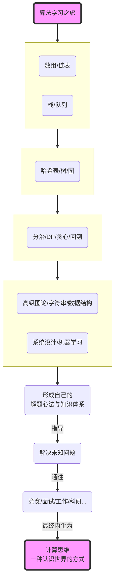

### **卷四 · 终章回望：冬境星璇的永恒诗篇**

*"当冬日的最后一片雪花，消融于春日的暖阳，那曾映照于我们眼中的、算法的漫天星璇，已化为心中，永不熄灭的、名为‘思想’的恒星。"*

毕业典礼的喧嚣，与区域赛金牌的荣光，都已渐渐沉淀，化为记忆中，一帧帧闪亮而温暖的画面。黛芙、伊莎贝尔和希娅，已经奔赴了她们各自的、全新的星辰大海。而安妮，也已经从一个需要被引领的“后辈”，成长为了一位能独当一面、指引他人的“学姐”。

“美少女的算法漫话”社团，在她的手中，被赋予了新的生命力。那间小小的活动室，依然在每一个阳光和煦的午后，和每一个星光璀璨的夜晚，上演着关于“0”和“1”的、新的青春故事。

一个冬日的午后，安妮独自一人，在活动室里，为即将到来的“世界总决赛（World Final）”做着最后的准备。她没有在刷题，而是打开了那个由她们四个人，共同创建的“算法漫话的星轨图”网站。

她从卷一的“樱花软糖雨”开始，一章一章地，重新回顾着她们共同走过的路。

-   **卷一的线性世界：** 她看到了数组的“秩序”与链表的“自由”，看到了栈的“后进先出”与队列的“先进先出”。那是她算法世界的“创世纪”，是一切开始的地方。
-   **卷二的非线性大陆：** 她看到了树的“层级”与图的“网络”，看到了哈希的“瞬移”，平衡树的“优雅”，以及在图的迷宫中，那些寻找路径、构建骨架的伟大算法。那是她的世界，从“线”到“面”的第一次升维。
-   **卷三的策略心法：** 她看到了分治的“分解”，DP的“远见”，贪心的“果决”，回溯的“执着”。那是她的思维，从“学会工具”到“掌握思想”的蜕变。
-   **卷四的高阶圣殿：** 她看到了那些更专门、更强大的“神器”——并查集、线段树、Trie、KMP……也看到了算法，是如何走出象牙塔，去构建起我们真实世界的导航、推荐、搜索和压缩……

她打开了黛芙学姐的“心法笔记”，扉页上，是她自己，在那个雪夜，写下的四句话：

-   **化繁为简**
-   **空间换时**
-   **逆向思维**
-   **数据为王**

安妮看着这些文字，又看了看窗外，那棵在冬日里，依然挺立的、积着白雪的樱花树。她忽然明白了，这趟旅程，教给她的，到底是什么。

它教给她的，不是背诵一段KMP的代码，不是默写一棵线段树的模板。它教给她的，是一种**思维方式**。

一种将混乱的世界，变得有序、清晰、可度量的思维方式。
一种在面对看似无解的难题时，懂得如何去分解、抽象、权衡、试错、并最终找到那条最优路径的思维方式。

这种思维方式，是她这两年多来，最宝贵的财富。它将陪伴着她，走过未来的每一次竞赛，每一次面试，甚至，是人生中的，每一次重大的抉择。

她站起身，在白板上，画下了这整个故事的、最后一幅“思维导图”。这不再是关于某一个章节的知识，而是关于“算法学习”这件事本身的、最终的回响。

画完这幅图，安妮长长地舒了一口气。她知道，她们的故事，作为一个“教学篇”，已经可以画上一个圆满的句号了。

她关上活动室的灯，锁上门。门外，是漫天的、寂静的星光。她知道，学姐们，正在各自的星空下，继续着她们的战斗与求索。而她自己，也即将踏上新的征途。

“算法漫话”的故事，结束了。但她们每个人的、关于算法的人生，才刚刚开始。

---

🌸 **最终卷·核心要点** 🌸

- **高级算法专题：**
    -   **图论：** 并查集、最小生成树、高级最短路、拓扑排序、LCA等，是解决网络、关系、依赖等问题的核心工具。
    -   **字符串：** Trie、KMP、Z算法、Manacher、滚动哈希等，是处理文本信息、进行高效匹配和结构分析的利器。
    -   **数据结构：** Bitset、树状数组、线段树、ST表、跳表、LRU等，是针对特定查询或更新场景，进行极致优化的“神器”。

- **从理论到现实：**
    -   **系统设计：** 学习如何将算法和数据结构，作为“组件”，去搭建一个完整、健壮、可扩展的真实系统。
    -   **算法应用：** 认识到我们所学的抽象算法，是如何在搜索引擎、导航、推荐系统、机器学习等现代科技的各个角落，发挥着基石作用的。

- **解题心法与元认知：**
    -   **流程与地图：** 建立结构化的解题流程和脑内的问题类型地图，是从“会做题”到“会解题”的跃迁。
    -   **思维与权衡：** 算法的最高境界，是内化为一种思维方式，学会在各种约束和目标之间，做出最合理的权衡与决策。

---

❄️ **安妮的最终章·独白** ❄️

两年多以前，我只是一个连“数组”和“链表”都分不清的、懵懂的女孩。我以为，代码，就是一行行冰冷的、没有生命的字符。

但在这间小小的活动室里，在与学姐们共同度过的、无数个日日夜夜里，我看到了一个全新的世界。

我看到，数组的“秩序”与链表的“自由”；
我看到，栈的“执着”与队列的“公平”；
我看到，哈希的“瞬移”与树的“生长”；
我看到，图的“连接”与网络的“无垠”；

我看到，分治的“分解”，DP的“远见”，贪心的“果决”，回溯的“勇敢”。

我看到，KMP的“自省”，Manacher的“对称”，霍夫曼的“诗艺”，Dijkstra的“光芒”。

我看到，这些冰冷的逻辑，在伊莎贝尔学姐的比喻里，化为了珍珠、星辰、花径与琴弦；在希娅学姐的键盘下，化为了AC的绿色气球和飞扬的青春；在黛芙学姐的白板上，化为了洞悉万物、指引方向的、永恒的“心法”。

算法，不再是算法。它是我看待世界的方式，是我解决问题的罗盘，是我和我的挚友们，用两年多的时光，共同谱写的一首，关于“成长”的、最长、最美的诗篇。

这首诗，今天，在这里，落下了最后一个音符。

但属于我的、新的乐章，才刚刚开始。

谢谢你们，我的学姐们。

谢谢你，算法。

---

> **计算思维 (Computational Thinking)**：是运用计算机科学的基础概念进行问题求解、系统设计、以及人类行为理解等的一系列思维活动。它不仅仅是编程，更是一种被所有人，在所有领域，都可以学习和运用的、强大的、普适的思维框架。

### 「全书 · 最终挑战」推荐练习题 🧲

> 真正的挑战，不在于再多做一道题，而在于，能否将你所学的，应用于你所热爱的。去为你喜欢的游戏，写一个辅助工具；去为你觉得不方便的网站，写一个浏览器插件；去参与一个你感兴趣的开源项目，贡献你的第一行代码……将算法的智慧，化为创造的力量，这，便是这场“算法漫话”的、最终的、也是唯一的“毕业设计”。

**（全文完）**
